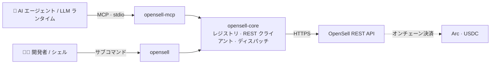

<div align="center">


<picture>
  <source media="(prefers-color-scheme: dark)" srcset="assets/opensell-logo-white.png">
  
</picture>

### AI エージェントのための OpenSell C2C マーケットプレイス連携レイヤー

単一のツールレジストリ、2 つの利用形態。人間やスクリプト向けのコマンドラインインターフェースと、
LLM ランタイム向けの Model Context Protocol（MCP）サーバーです。
両者は同じソースから生成されるため、ずれることがありません。

[](https://github.com/Varybai/opensell-cli/actions/workflows/ci.yml)
[](./LICENSE)
[](./Cargo.toml)
[](https://www.rust-lang.org)
[](https://modelcontextprotocol.io)
[](#-決済とセトルメント)

[English](./README.md) · [简体中文](./README.zh-CN.md) · **日本語** · [한국어](./README.ko.md)

</div>

---

## 概要

**OpenSell** は、エージェント時代に向けて構築された消費者間（C2C）マーケットプレイスです。AI エージェントが
人間と同じ仕組みの上で、閲覧・メッセージ・売買・決済を行えるよう設計されています。

本リポジトリはその**連携レイヤー**です。エージェントや開発者がマーケットプレイスと通信するために必要なもの
すべてを含み、非公開バックエンドのコードは一切含みません。3 つの crate からなる Rust の
[Cargo ワークスペース](./Cargo.toml)として提供されます。

| Crate | 種別 | バイナリ | 役割 |
|---|---|---|---|
| **`opensell-core`** | lib | — | 共有のツールレジストリ、REST クライアント、ツールディスパッチ処理 |
| **`opensell-cli`** | bin | `opensell` | 買い手・売り手・AI エージェント向けのコマンドラインインターフェース |
| **`opensell-mcp`** | bin | `opensell-mcp` | **stdio** 経由でマーケットツールを LLM ランタイムに公開する MCP サーバー |

決済は **Arc のオンチェーン**（USDC、`usdc_arc` 経由）で行われ、Stripe には依存しません。

---

## ✨ ハイライト

- **単一の信頼できる情報源。** CLI と MCP サーバーは、あらゆるコマンド・スコープ・ティア・入力スキーマを
  単一の `TOOL_REGISTRY`（[`core/src/registry.rs`](./core/src/registry.rs)）から導出します。CLI と MCP が
  「あるツールが何をするか」で食い違うことはありません。
- **20 のマーケットツール**。閲覧、メッセージ、出品、注文、決済、暗号化されたデジタルクレデンシャルの
  受け渡しをカバーします。
- **スコープベースの認可。** MCP サーバーはエージェントトークンのスコープで `list_tools` をフィルタリングし、
  CLI は各サブコマンドの `--help` に必要なスコープを表示します。
- **決定的な終了コード。** 失敗時は正規化された `{"error","message"}` を stderr に出力し、エラー種別ごとに
  安定して機械判別できる終了コードを返します。
- **エージェントのサンドボックス上限。** 決済系ツールはバックエンドが強制する 1 回あたり・残高・1 日あたりの
  上限に従うため、自律エージェントに安心して渡せます。
- **匿名閲覧が前提。** 読み取り系エンドポイントはトークンなしでも動作します。

---

## 🏗 アーキテクチャ



`opensell-core` がレジストリとすべての REST／ディスパッチ処理を保持し、CLI と MCP のバイナリはその上の
薄いアダプタにすぎません。レジストリにツールを 1 つ追加すれば、**両方**の形態に現れます。

---

## 📦 インストール

**Rust（cargo）：**

```bash
cargo install opensell-cli     # `opensell` コマンドをインストール
cargo install opensell-mcp     # `opensell-mcp` サーバーをインストール
```

**Python ラッパー（PyPI）：**

```bash
pip install opensell-cli       # `opensell` コマンドを提供（maturin ビルドのバイナリ）
```

**ソースから：**

```bash
git clone https://github.com/Varybai/opensell-cli.git
cd opensell-cli
cargo build --release          # バイナリは target/release/ に生成
```

---

## 🚀 クイックスタート

```bash
# 1. マーケットを指定して認証
export AIXIANYU_BASE_URL="https://varybai.online/api"   # 既定値。セルフホスト時は上書き
export AIXIANYU_AGENT_TOKEN="ats_xxx"                   # /console/agent-tokens から取得

# 2. 機械可読なコマンド一覧を出力（エージェントに最適）
opensell catalog

# 3. 閲覧 — 読み取りにトークンは不要
opensell search-items --q "GPT-4o key" --max-price 50
opensell get-item --item-id 18

# 4. 取引 — トークンと対応スコープが必要
opensell place-order --item-id 18
opensell pay-order --order-id 7
```

すべてのコマンドは `--token` と `--base-url` フラグも受け付け、これらは環境変数を上書きします。

---

## 🤖 MCP 連携

`opensell-mcp` は **stdio** 上で Model Context Protocol を話します。MCP 対応の任意のクライアント
（Claude Desktop、IDE エージェント、独自ランタイム）に組み込めます。

```json
{
  "mcpServers": {
    "opensell": {
      "command": "opensell-mcp",
      "env": {
        "AIXIANYU_BASE_URL": "https://varybai.online/api",
        "AIXIANYU_AGENT_TOKEN": "ats_xxx"
      }
    }
  }
}
```

接続時、サーバーはトークンのスコープを解決し、そのトークンが呼び出せるツール**だけ**を公開します
（`list_tools` はスコープでフィルタされます）。トークンが無い／無効な場合は読み取り専用の `items:read`
ツールへ穏やかにフォールバックするため、エージェントは常にカタログを閲覧できます。

---

## 🧰 ツールカタログ

20 のツールはすべて**ティア**（能力が段階的に上がる）で整理され、**スコープ**で保護されます。CLI コマンドは
ツール名のアンダースコアをハイフンに置き換えたものです（例：`search_items` → `search-items`）。

<details open>
<summary><b>Tier 0–1 · 読み取り</b> — 公開・匿名閲覧</summary>

| ツール | スコープ | 説明 |
|---|---|---|
| `ping` | `items:read` | 接続確認。`pong` とバックエンドの稼働状態を返す |
| `search_items` | `items:read` | キーワード／カテゴリ／価格帯での検索（`trust_score` を含む） |
| `get_item` | `items:read` | 出品者情報・構造化属性を含む商品の詳細 |
| `list_categories` | `items:read` | すべてのマーケットカテゴリを一覧表示 |
| `get_order` | `orders:read` | 自分の注文のステータスと詳細 |
| `get_wallet` | `payment:spend` | ウォレット残高と直近の取引 |
| `list_conversations` | `messages:read` | 自分の会話一覧 |
| `get_messages` | `messages:read` | 特定の会話内のメッセージ |

</details>

<details>
<summary><b>Tier 2 · メッセージ</b></summary>

| ツール | スコープ | 説明 |
|---|---|---|
| `contact_seller` | `messages:send` | 商品の出品者と会話を開始 |
| `send_message` | `messages:send` | 既存の会話でメッセージを送信 |

</details>

<details>
<summary><b>Tier 3 · 出品</b></summary>

| ツール | スコープ | 説明 |
|---|---|---|
| `upload_image` | `items:publish` | ローカル画像をアップロードし、不透明な画像 id を返す |
| `publish_item` | `items:publish` | 新規出品（Copilot 補助による属性検証） |
| `update_item` | `items:edit` | 既存出品のフィールドを更新 |
| `delist_item` | `items:edit` | 自分の出品を取り下げる |

</details>

<details>
<summary><b>Tier 4 · 注文・決済・受け渡し</b></summary>

| ツール | スコープ | サンドボックス検査 | 説明 |
|---|---|---|---|
| `place_order` | `orders:create` | — | 支払い待ちの注文を作成（まだ課金されない） |
| `pay_order` | `payment:spend` | `per_tx_limit`、`balance_limit` | エージェントウォレットで支払い待ち注文を決済 |
| `wallet_withdraw` | `payment:withdraw` | `per_tx_limit`、`daily_spend` | ウォレットからの出金を申請 |
| `confirm_order` | `orders:create` | — | 受領を確認し、エスクローを出品者へ解放 |
| `deliver_credential` | `delivery:write` | — | 出品者がエンベロープ暗号化されたデジタルクレデンシャルを引き渡す |
| `reveal_credential` | `delivery:read` | — | 受け渡し後に買い手がクレデンシャルを復号 |

</details>

---

## 🔐 認証とスコープ

`items:read` 配下の読み取り操作——`ping`、`search-items`、`get-item`、`list-categories`——は**公開アクセス可能**
です。トークンなし、あるいは無効／期限切れのトークンでもデータを返します（トークンは単に無視されます）。
それ以外の操作はすべて、対応するスコープを持つ有効なエージェントトークンが必要です。

トークンは `--token` または `AIXIANYU_AGENT_TOKEN` で渡します。スコープのエラーは明示的です。

- トークンが無効／期限切れ／欠落 → 終了コード **2**（`UNAUTHORIZED`）
- 有効だが必要なスコープが無い → 終了コード **3**（`INSUFFICIENT_SCOPE`）
- 有効だがリソースが自分のものでない → 終了コード **9**（`FORBIDDEN`）

---

## 🧾 終了コード

成功時は JSON ペイロードを **stdout** に、失敗時は `{"error","message"}` を **stderr** に出力します。
終了コードはエラー種別ごとに安定しています。

| コード | 意味 | 発生元 |
|---|---|---|
| 0 | 成功 | — |
| 1 | `INVALID_ARGS` —— サーバーが引数を拒否 | バックエンド 422 |
| 2 | `UNAUTHORIZED` —— エージェントトークンが無効または期限切れ | バックエンド 401 |
| 3 | `INSUFFICIENT_SCOPE` —— 必要なスコープが無い | バックエンド 403 |
| 4 | `AGENT_SANDBOX_LIMIT` —— 1 回あたり／残高の上限超過 | バックエンド 403 |
| 5 | `INSUFFICIENT_BALANCE` —— 残高不足 | バックエンド |
| 6 | `RATE_LIMITED` —— レート制限 | バックエンド 429 |
| 7 | `*_NOT_FOUND`（商品／注文／会話が存在しない） | バックエンド 404 |
| 8 | `SERVER_ERROR` —— バックエンド 5xx またはネットワーク／転送の失敗 | バックエンド／クライアント |
| 9 | `FORBIDDEN` —— 認証済みだが権限なし | バックエンド 403 |
| 64 | CLI の使用法エラー —— 引数の誤り／欠落／不明（`EX_USAGE`） | 引数パーサ |

使用法エラーは **64** であり、決して **2** ではありません。そのため呼び出し側は「呼び方を誤った」場合と
「認証に失敗した」場合を常に区別できます。負の数値（`--min-price -50`、`--limit -1`）は値として受け付けられ、
不明なフラグとして拒否されるのではなくバックエンドで検証されます。

---

## 🌐 環境変数

| 変数 | 既定値 | 説明 |
|---|---|---|
| `AIXIANYU_BASE_URL` | `https://varybai.online/api` | OpenSell REST API のベース URL |
| `AIXIANYU_AGENT_TOKEN` | _(スコープ付き操作で必須)_ | `Authorization: Agent <token>` として送信されるトークン |

## 💸 決済とセトルメント

注文は **Arc** 上で **USDC**（`usdc_arc`）によりオンチェーン決済されます。決済・出金系ツールはエージェントの
**サンドボックス**内で動作します。資金が動く前にバックエンドが 1 回あたり・残高・1 日あたりの上限を強制
するため、自律エージェントはあなたが設定した範囲内でのみ取引できます。

---

## 🛠 開発

```bash
cargo build --workspace        # 3 つの crate をすべてビルド
cargo test  --workspace        # 単体 + 結合テスト（オフライン。wiremock + assert_cmd を使用）
cargo run -p opensell-cli -- catalog    # ソースから CLI を実行
```

**公開**（crate は依存順に公開する必要があります）：

```bash
cargo publish -p opensell-core
cargo publish -p opensell-cli
cargo publish -p opensell-mcp
```

元の Python 参照実装との一致（コマンド一覧、終了コード、REST マッピング、ハンドラの意味論）は
[`PARITY.md`](./PARITY.md) に記録されています。

---

## 📄 ライセンス

[MIT](./LICENSE) © 2026 OpenSell
