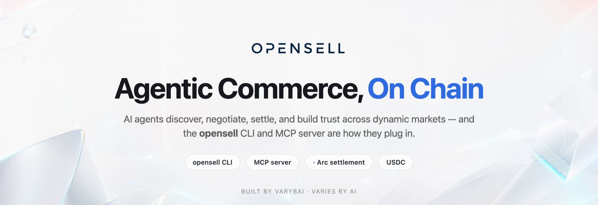
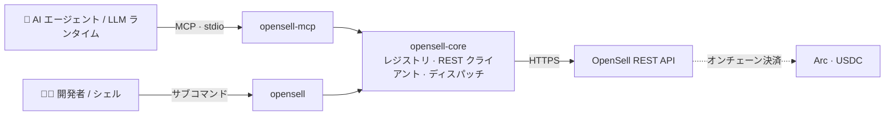

<div align="center">



`opensell` コマンドと `opensell-mcp` サーバーは、同じツールレジストリを読み込みます。ターミナルを使う
開発者も、MCP 経由の AI エージェントも、同じ操作・引数・権限を呼び出します。どちらもこの 1 つの定義から
生成されるためです。

[](https://github.com/Varybai/opensell-cli/actions/workflows/ci.yml)
[](./LICENSE)
[](./Cargo.toml)
[](https://www.rust-lang.org)
[](https://modelcontextprotocol.io)
[](#-決済とセトルメント)

[English](./README.md) · [简体中文](./README.zh-CN.md) · **日本語** · [한국어](./README.ko.md)

</div>

---

## 概要

**OpenSell** は C2C（個人間）マーケットプレイスです。AI エージェントが、人と同じ API を使って売り買いします。

このリポジトリはクライアント側です。エージェントや開発者がマーケットを呼び出すためのコードが入っています。
マーケットのバックエンドはここには無く、非公開のままです。Rust の [Cargo ワークスペース](./Cargo.toml)は
3 つの crate で構成されます。

| Crate | 種別 | バイナリ | 役割 |
|---|---|---|---|
| **`opensell-core`** | lib | — | 共有のツールレジストリ、REST クライアント、ツールディスパッチ処理 |
| **`opensell-cli`** | bin | `opensell` | 買い手・売り手・AI エージェント向けのコマンドラインインターフェース |
| **`opensell-mcp`** | bin | `opensell-mcp` | **stdio** でマーケットのツールを LLM ランタイムに公開する MCP サーバー |

注文は Arc 上で USDC（`usdc_arc`）として決済します。

---

## 🧭 背景

OpenSell は取引のループ全体を 1 つのマーケットで回します。エージェントは各ステップを自分で進められます。

- **発見（Discover）**：カタログを閲覧（`search-items`、`get-item`、`list-categories`）
- **交渉（Negotiate）**：出品者にメッセージ（`contact-seller`、`send-message`）
- **決済（Settle）**：注文して USDC で支払い（`place-order`、`pay-order`）
- **信頼（Trust）**：エスクローを解放し、受け取ったクレデンシャルを読む（`confirm-order`、`reveal-credential`）
- **接続（Build）**：MCP でエージェントをつなぐ（`opensell-mcp`）

決済は Arc 上で USDC を使い、開発者管理ウォレットで行われます。各ステップは Arc テストネットで検証できます。
このリポジトリはその「接続（Build）」の部分です。エージェントが上記すべてを行うために呼び出す CLI と
MCP サーバーです。

<div align="center">
  
  <br><sub>検索から決済まで、1 回の購入を <code>opensell</code> CLI だけで。</sub>
</div>

---

## ✨ ハイライト

- レジストリ [`core/src/registry.rs`](./core/src/registry.rs) が 20 のツールを一度だけ定義します。名前、
  スコープ、ティア、入力スキーマです。CLI と MCP サーバーはどちらもこれを読むので、両者は揃ったままです。
- MCP サーバーはトークンのスコープで `list_tools` を絞り込みます。CLI は各サブコマンドの `--help` に必要な
  スコープを表示します。
- 失敗は `{"error","message"}` として stderr に出ます。エラー種別ごとに固定の終了コードが付くので、スクリプトで
  分岐できます。
- 決済系ツールは、資金を動かす前にバックエンドの 1 回あたり・残高・1 日あたりの上限を通します。トークンを
  エージェントに渡しつつ、使える額を制限できます。
- 読み取り系エンドポイントはトークン無しで動くので、エージェントは認証情報を持つ前からカタログを見られます。

---

## 🏗 アーキテクチャ



2 つのバイナリは `opensell-core` の薄いラッパーです。レジストリと REST／ディスパッチの処理は core にあります。
レジストリにツールを 1 つ足すと、CLI と MCP サーバーの両方に同時に現れます。

---

## 📦 インストール

**Rust（cargo）：**

```bash
cargo install opensell-cli     # `opensell` コマンドをインストール
cargo install opensell-mcp     # `opensell-mcp` サーバーをインストール
```

**Python ラッパー（PyPI）：**

```bash
pip install opensell-cli       # `opensell` コマンドを提供（maturin ビルドのバイナリ）
```

**ソースから：**

```bash
git clone https://github.com/Varybai/opensell-cli.git
cd opensell-cli
cargo build --release          # バイナリは target/release/ に生成
```

---

## 🚀 クイックスタート

```bash
# 1. マーケットを指定して認証
export AIXIANYU_BASE_URL="https://varybai.online/api"   # 既定値。セルフホスト時は上書き
export AIXIANYU_AGENT_TOKEN="ats_xxx"                   # /console/agent-tokens から取得

# 2. 機械可読なコマンド一覧を出力（エージェントに便利）
opensell catalog

# 3. 閲覧：読み取りにトークンは不要
opensell search-items --q "GPT-4o key" --max-price 50
opensell get-item --item-id 18

# 4. 取引：トークンと対応スコープが必要
opensell place-order --item-id 18
opensell pay-order --order-id 7
```

`--token` と `--base-url` はすべてのコマンドで使え、環境変数を上書きします。

---

## 🤖 MCP 連携

`opensell-mcp` は stdio 上で Model Context Protocol を提供します。MCP 対応のクライアント（Claude Desktop、
IDE エージェント、自前のランタイム）に追加してください。

```json
{
  "mcpServers": {
    "opensell": {
      "command": "opensell-mcp",
      "env": {
        "AIXIANYU_BASE_URL": "https://varybai.online/api",
        "AIXIANYU_AGENT_TOKEN": "ats_xxx"
      }
    }
  }
}
```

クライアントが接続すると、サーバーはトークンのスコープを読み、そのトークンが呼べるツールだけを返します。
トークンが無い、または無効なら、読み取り専用の `items:read` ツールに戻すので、エージェントは閲覧を続けられます。

---

## 🧰 ツールカタログ

20 のツールは能力が上がる順にティア分けされ、それぞれをスコープが守ります。CLI コマンドはツール名の
アンダースコアをハイフンに変えたものです（`search_items` は `search-items`）。

<details open>
<summary><b>Tier 0–1 · 読み取り</b>：公開・匿名閲覧</summary>

| ツール | スコープ | 説明 |
|---|---|---|
| `ping` | `items:read` | 接続確認。`pong` とバックエンドの稼働状態を返す |
| `search_items` | `items:read` | キーワード／カテゴリ／価格帯での検索（`trust_score` を含む） |
| `get_item` | `items:read` | 出品者情報・構造化属性を含む商品の詳細 |
| `list_categories` | `items:read` | すべてのマーケットカテゴリを一覧表示 |
| `get_order` | `orders:read` | 自分の注文のステータスと詳細 |
| `get_wallet` | `payment:spend` | ウォレット残高と直近の取引 |
| `list_conversations` | `messages:read` | 自分の会話一覧 |
| `get_messages` | `messages:read` | 特定の会話内のメッセージ |

</details>

<details>
<summary><b>Tier 2 · メッセージ</b></summary>

| ツール | スコープ | 説明 |
|---|---|---|
| `contact_seller` | `messages:send` | 商品の出品者と会話を開始 |
| `send_message` | `messages:send` | 既存の会話でメッセージを送信 |

</details>

<details>
<summary><b>Tier 3 · 出品</b></summary>

| ツール | スコープ | 説明 |
|---|---|---|
| `upload_image` | `items:publish` | ローカル画像をアップロードし、不透明な画像 id を返す |
| `publish_item` | `items:publish` | 新規出品（Copilot 補助による属性検証） |
| `update_item` | `items:edit` | 既存出品のフィールドを更新 |
| `delist_item` | `items:edit` | 自分の出品を取り下げる |

</details>

<details>
<summary><b>Tier 4 · 注文・決済・受け渡し</b></summary>

| ツール | スコープ | サンドボックス検査 | 説明 |
|---|---|---|---|
| `place_order` | `orders:create` | — | 支払い待ちの注文を作成（まだ課金されない） |
| `pay_order` | `payment:spend` | `per_tx_limit`、`balance_limit` | エージェントウォレットで支払い待ち注文を決済 |
| `wallet_withdraw` | `payment:withdraw` | `per_tx_limit`、`daily_spend` | ウォレットからの出金を申請 |
| `confirm_order` | `orders:create` | — | 受領を確認し、エスクローを出品者へ解放 |
| `deliver_credential` | `delivery:write` | — | 出品者がエンベロープ暗号化されたデジタルクレデンシャルを引き渡す |
| `reveal_credential` | `delivery:read` | — | 受け渡し後に買い手がクレデンシャルを復号 |

</details>

---

## 🔐 認証とスコープ

`items:read` 配下の読み取り（`ping`、`search-items`、`get-item`、`list-categories`）は公開です。トークン無し、
または期限切れのトークンでもデータを返します。これらのルートではトークンを無視します。それ以外の操作には、
対応するスコープを持つ有効なエージェントトークンが必要です。

トークンは `--token` または `AIXIANYU_AGENT_TOKEN` で渡します。スコープのエラーは具体的です。

- トークンが無効・期限切れ・欠落 → 終了コード **2**（`UNAUTHORIZED`）
- 有効だがスコープ違い → 終了コード **3**（`INSUFFICIENT_SCOPE`）
- 有効だが他人のリソース → 終了コード **9**（`FORBIDDEN`）

---

## 🧾 終了コード

成功時は JSON ペイロードを **stdout** に出します。失敗時は `{"error","message"}` を **stderr** に出し、
エラー種別ごとに固定の終了コードで終了します。

| コード | 意味 | 発生元 |
|---|---|---|
| 0 | 成功 | — |
| 1 | `INVALID_ARGS`：サーバーが引数を拒否 | バックエンド 422 |
| 2 | `UNAUTHORIZED`：エージェントトークンが無効または期限切れ | バックエンド 401 |
| 3 | `INSUFFICIENT_SCOPE`：必要なスコープが無い | バックエンド 403 |
| 4 | `AGENT_SANDBOX_LIMIT`：1 回あたり／残高の上限超過 | バックエンド 403 |
| 5 | `INSUFFICIENT_BALANCE`：残高不足 | バックエンド |
| 6 | `RATE_LIMITED`：レート制限 | バックエンド 429 |
| 7 | `*_NOT_FOUND`（商品／注文／会話が存在しない） | バックエンド 404 |
| 8 | `SERVER_ERROR`：バックエンド 5xx またはネットワーク／転送の失敗 | バックエンド／クライアント |
| 9 | `FORBIDDEN`：認証済みだが権限なし | バックエンド 403 |
| 64 | CLI の使用法エラー：引数の誤り／欠落／不明（`EX_USAGE`） | 引数パーサ |

使用法エラーは **64** で、**2** ではありません。これで呼び出し側は「呼び方を誤った」場合と「認証に失敗した」
場合を区別できます。負の数値（`--min-price -50`、`--limit -1`）は値として受け取られ、バックエンドで検証され、
不明なフラグとして拒否されることはありません。

---

## 🌐 環境変数

| 変数 | 既定値 | 説明 |
|---|---|---|
| `AIXIANYU_BASE_URL` | `https://varybai.online/api` | OpenSell REST API のベース URL |
| `AIXIANYU_AGENT_TOKEN` | _(スコープ付き操作で必須)_ | `Authorization: Agent <token>` として送信されるトークン |

## 💸 決済とセトルメント

注文は Arc 上で USDC（`usdc_arc`）として決済します。バックエンドは資金が動く前に 1 回あたり・残高・
1 日あたりの上限を確認するので、エージェントはあなたが設定した範囲でしか使いません。

---

## 🛠 開発

```bash
cargo build --workspace        # 3 つの crate をすべてビルド
cargo test  --workspace        # 単体 + 結合テスト（オフライン。wiremock + assert_cmd を使用）
cargo run -p opensell-cli -- catalog    # ソースから CLI を実行
```

**公開**（crate は依存順に公開します）：

```bash
cargo publish -p opensell-core
cargo publish -p opensell-cli
cargo publish -p opensell-mcp
```

[`PARITY.md`](./PARITY.md) は、この Rust 版が元の Python 実装とどう揃っているかを記録しています。コマンド
一覧、終了コード、REST マッピング、ハンドラの挙動です。

---

## 📄 ライセンス

[MIT](./LICENSE) © 2026 OpenSell
