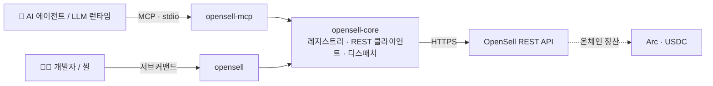

<div align="center">


`opensell` 명령과 `opensell-mcp` 서버는 같은 도구 레지스트리를 읽습니다. 터미널을 쓰는 개발자도, MCP로
연결한 AI 에이전트도 같은 작업·인자·권한을 호출합니다. 둘 다 이 하나의 정의에서 생성되기 때문입니다.

[](https://github.com/Varybai/opensell-cli/actions/workflows/ci.yml)
[](./LICENSE)
[](./Cargo.toml)
[](https://www.rust-lang.org)
[](https://modelcontextprotocol.io)
[](#-결제-및-정산)

[English](./README.md) · [简体中文](./README.zh-CN.md) · [日本語](./README.ja.md) · **한국어**

</div>

---

## 개요

**OpenSell** 은 C2C(개인 간) 마켓플레이스입니다. AI 에이전트가 사람과 같은 API로 사고팝니다.

이 저장소는 클라이언트 쪽입니다. 에이전트나 개발자가 마켓을 호출하는 데 필요한 코드가 들어 있습니다.
마켓 백엔드는 여기 없고 비공개로 둡니다. Rust [Cargo 워크스페이스](./Cargo.toml)는 3개의 crate로
이루어집니다.

| Crate | 종류 | 바이너리 | 역할 |
|---|---|---|---|
| **`opensell-core`** | lib | — | 공유 도구 레지스트리, REST 클라이언트, 도구 디스패치 로직 |
| **`opensell-cli`** | bin | `opensell` | 구매자·판매자·AI 에이전트를 위한 커맨드라인 인터페이스 |
| **`opensell-mcp`** | bin | `opensell-mcp` | **stdio** 로 마켓 도구를 LLM 런타임에 공개하는 MCP 서버 |

주문은 Arc 위에서 USDC(`usdc_arc`)로 정산합니다.

---

## 🧭 배경

OpenSell 은 거래 루프 전체를 하나의 마켓에서 돌립니다. 에이전트가 각 단계를 직접 진행할 수 있습니다.

- **발견(Discover)**: 카탈로그 탐색(`search-items`, `get-item`, `list-categories`)
- **협상(Negotiate)**: 판매자에게 메시지(`contact-seller`, `send-message`)
- **결제(Settle)**: 주문하고 USDC로 결제(`place-order`, `pay-order`)
- **신뢰(Trust)**: 에스크로 해제, 전달된 자격 증명 확인(`confirm-order`, `reveal-credential`)
- **연동(Build)**: MCP로 에이전트 연결(`opensell-mcp`)

정산은 Arc 위에서 USDC로, 개발자 관리 지갑을 통해 이루어집니다. 각 단계는 Arc 테스트넷에서 검증할 수
있습니다. 이 저장소는 그 "연동(Build)" 부분입니다. 에이전트가 위의 모든 것을 하기 위해 호출하는 CLI와
MCP 서버입니다.

<div align="center">
  
  <br><sub>검색부터 정산까지, 한 번의 구매를 <code>opensell</code> CLI 하나로.</sub>
</div>

---

## ✨ 주요 특징

- 레지스트리 [`core/src/registry.rs`](./core/src/registry.rs) 가 20개 도구를 한 번에 정의합니다. 이름,
  스코프, 티어, 입력 스키마입니다. CLI와 MCP 서버가 모두 이것을 읽으므로 둘은 어긋나지 않습니다.
- MCP 서버는 토큰의 스코프로 `list_tools` 를 거릅니다. CLI는 각 서브커맨드의 `--help` 에 필요한 스코프를
  표시합니다.
- 실패는 `{"error","message"}` 로 stderr에 나옵니다. 오류 종류마다 고정 종료 코드가 붙어 스크립트가 분기할
  수 있습니다.
- 결제 계열 도구는 돈이 움직이기 전에 백엔드의 건당·잔액·일일 한도를 거칩니다. 에이전트에게 토큰을 주면서
  쓸 수 있는 금액을 제한할 수 있습니다.
- 읽기 엔드포인트는 토큰 없이 동작하므로, 에이전트는 자격 증명을 갖기 전에도 카탈로그를 볼 수 있습니다.

---

## 🏗 아키텍처



두 바이너리는 `opensell-core` 위의 얇은 래퍼입니다. 레지스트리와 REST／디스패치 로직은 core에 있습니다.
레지스트리에 도구를 하나 추가하면 CLI와 MCP 서버에 동시에 나타납니다.

---

## 📦 설치

**Rust(cargo):**

```bash
cargo install opensell-cli     # `opensell` 명령 설치
cargo install opensell-mcp     # `opensell-mcp` 서버 설치
```

**Python 래퍼(PyPI):**

```bash
pip install opensell-cli       # `opensell` 명령 제공(maturin으로 빌드된 바이너리)
```

**소스에서 빌드:**

```bash
git clone https://github.com/Varybai/opensell-cli.git
cd opensell-cli
cargo build --release          # 바이너리는 target/release/ 에 생성
```

---

## 🚀 빠른 시작

```bash
# 1. 마켓을 지정하고 인증
export AIXIANYU_BASE_URL="https://varybai.online/api"   # 기본값. 셀프 호스팅 시 덮어쓰기
export AIXIANYU_AGENT_TOKEN="ats_xxx"                   # /console/agent-tokens 에서 발급

# 2. 기계가 읽을 수 있는 전체 명령 목록 출력(에이전트에 편리)
opensell catalog

# 3. 탐색: 읽기에는 토큰이 필요 없음
opensell search-items --q "GPT-4o key" --max-price 50
opensell get-item --item-id 18

# 4. 거래: 토큰과 해당 스코프 필요
opensell place-order --item-id 18
opensell pay-order --order-id 7
```

`--token` 과 `--base-url` 는 모든 명령에서 동작하며 환경 변수를 덮어씁니다.

---

## 🤖 MCP 연동

`opensell-mcp` 는 stdio 위에서 Model Context Protocol을 제공합니다. MCP를 지원하는 클라이언트(Claude
Desktop, IDE 에이전트, 직접 만든 런타임)에 추가하세요.

```json
{
  "mcpServers": {
    "opensell": {
      "command": "opensell-mcp",
      "env": {
        "AIXIANYU_BASE_URL": "https://varybai.online/api",
        "AIXIANYU_AGENT_TOKEN": "ats_xxx"
      }
    }
  }
}
```

클라이언트가 연결하면 서버는 토큰의 스코프를 읽어, 그 토큰이 호출할 수 있는 도구만 반환합니다. 토큰이
없거나 잘못된 경우 읽기 전용 `items:read` 도구로 되돌리므로 에이전트는 계속 탐색할 수 있습니다.

<div align="center">
  
  <br><sub>모바일 개인 AI 에이전트가 <code>opensell</code> 도구로 구매합니다. 검색·주문·결제를 사용자가 정한 한도 안에서 처리합니다.</sub>
</div>

---

## 🧰 도구 카탈로그

20개 도구는 능력이 올라가는 순서로 티어로 나뉘고, 각각을 스코프가 지킵니다. CLI 명령은 도구 이름의
밑줄을 하이픈으로 바꾼 것입니다(`search_items` 는 `search-items`).

<details open>
<summary><b>Tier 0–1 · 읽기</b>: 공개, 익명 탐색</summary>

| 도구 | 스코프 | 설명 |
|---|---|---|
| `ping` | `items:read` | 연결 확인. `pong` 과 백엔드 상태를 반환 |
| `search_items` | `items:read` | 키워드／카테고리／가격대 검색(`trust_score` 포함) |
| `get_item` | `items:read` | 판매자 정보·구조화 속성을 포함한 상품 상세 |
| `list_categories` | `items:read` | 모든 마켓 카테고리 나열 |
| `get_order` | `orders:read` | 내 주문의 상태와 상세 |
| `get_wallet` | `payment:spend` | 지갑 잔액과 최근 거래 |
| `list_conversations` | `messages:read` | 내 대화 목록 |
| `get_messages` | `messages:read` | 특정 대화의 메시지 |

</details>

<details>
<summary><b>Tier 2 · 메시지</b></summary>

| 도구 | 스코프 | 설명 |
|---|---|---|
| `contact_seller` | `messages:send` | 상품 판매자와 대화 시작 |
| `send_message` | `messages:send` | 기존 대화에서 메시지 전송 |

</details>

<details>
<summary><b>Tier 3 · 등록</b></summary>

| 도구 | 스코프 | 설명 |
|---|---|---|
| `upload_image` | `items:publish` | 로컬 이미지를 업로드하고 불투명 이미지 id 반환 |
| `publish_item` | `items:publish` | 새 상품 등록(Copilot 보조 속성 검증) |
| `update_item` | `items:edit` | 기존 상품의 필드 업데이트 |
| `delist_item` | `items:edit` | 본인 상품 내리기 |

</details>

<details>
<summary><b>Tier 4 · 주문·결제·전달</b></summary>

| 도구 | 스코프 | 샌드박스 검사 | 설명 |
|---|---|---|---|
| `place_order` | `orders:create` | — | 결제 대기 주문 생성(아직 청구되지 않음) |
| `pay_order` | `payment:spend` | `per_tx_limit`, `balance_limit` | 에이전트 지갑으로 결제 대기 주문 결제 |
| `wallet_withdraw` | `payment:withdraw` | `per_tx_limit`, `daily_spend` | 지갑 출금 요청 |
| `confirm_order` | `orders:create` | — | 수령 확인 후 에스크로를 판매자에게 해제 |
| `deliver_credential` | `delivery:write` | — | 판매자가 봉투 암호화된 디지털 자격 증명을 전달 |
| `reveal_credential` | `delivery:read` | — | 구매자가 전달 후 자격 증명을 복호화 |

</details>

---

## 🔐 인증 및 스코프

`items:read` 하위의 읽기(`ping`, `search-items`, `get-item`, `list-categories`)는 공개입니다. 토큰이 없거나
만료된 토큰으로도 데이터를 반환합니다. 이 경로에서는 토큰을 무시합니다. 그 외 작업은 해당 스코프를 가진
유효한 에이전트 토큰이 필요합니다.

토큰은 `--token` 또는 `AIXIANYU_AGENT_TOKEN` 으로 전달합니다. 스코프 오류는 구체적입니다.

- 토큰이 유효하지 않음·만료·누락 → 종료 코드 **2**(`UNAUTHORIZED`)
- 유효하지만 스코프가 다름 → 종료 코드 **3**(`INSUFFICIENT_SCOPE`)
- 유효하지만 남의 리소스 → 종료 코드 **9**(`FORBIDDEN`)

---

## 🧾 종료 코드

성공 시 JSON 페이로드를 **stdout** 으로 출력합니다. 실패 시 `{"error","message"}` 를 **stderr** 로 출력하고
오류 종류마다 고정 코드로 종료합니다.

| 코드 | 의미 | 출처 |
|---|---|---|
| 0 | 성공 | — |
| 1 | `INVALID_ARGS`: 서버가 인자를 거부 | 백엔드 422 |
| 2 | `UNAUTHORIZED`: 에이전트 토큰이 유효하지 않거나 만료 | 백엔드 401 |
| 3 | `INSUFFICIENT_SCOPE`: 필요한 스코프가 없음 | 백엔드 403 |
| 4 | `AGENT_SANDBOX_LIMIT`: 건당／잔액 한도 초과 | 백엔드 403 |
| 5 | `INSUFFICIENT_BALANCE`: 잔액 부족 | 백엔드 |
| 6 | `RATE_LIMITED`: 속도 제한 | 백엔드 429 |
| 7 | `*_NOT_FOUND`(상품／주문／대화 없음) | 백엔드 404 |
| 8 | `SERVER_ERROR`: 백엔드 5xx 또는 네트워크／전송 실패 | 백엔드／클라이언트 |
| 9 | `FORBIDDEN`: 인증됐지만 권한 없음 | 백엔드 403 |
| 64 | CLI 사용 오류: 인자 오류／누락／알 수 없음(`EX_USAGE`) | 인자 파서 |

사용 오류는 **64** 이고 **2** 가 아닙니다. 그래서 호출자는 "잘못 호출했다" 와 "인증에 실패했다" 를 구분할
수 있습니다. 음수 값(`--min-price -50`, `--limit -1`)은 값으로 받아들여 백엔드에서 검증하며, 알 수 없는
플래그로 거부하지 않습니다.

---

## 🌐 환경 변수

| 변수 | 기본값 | 설명 |
|---|---|---|
| `AIXIANYU_BASE_URL` | `https://varybai.online/api` | OpenSell REST API 기본 URL |
| `AIXIANYU_AGENT_TOKEN` | _(스코프 작업에 필수)_ | `Authorization: Agent <token>` 로 전송되는 토큰 |

## 💸 결제 및 정산

주문은 Arc 위에서 USDC(`usdc_arc`)로 정산합니다. 백엔드는 돈이 움직이기 전에 건당·잔액·일일 한도를
확인하므로, 에이전트는 당신이 정한 범위 안에서만 사용합니다.

---

## 🛠 개발

```bash
cargo build --workspace        # 세 crate 모두 빌드
cargo test  --workspace        # 단위 + 통합 테스트(오프라인. wiremock + assert_cmd 사용)
cargo run -p opensell-cli -- catalog    # 소스에서 CLI 실행
```

**배포**(crate는 의존성 순서대로 배포):

```bash
cargo publish -p opensell-core
cargo publish -p opensell-cli
cargo publish -p opensell-mcp
```

[`PARITY.md`](./PARITY.md) 는 이 Rust 버전이 원본 Python 구현과 어떻게 맞춰져 있는지 기록합니다. 명령
목록, 종료 코드, REST 매핑, 핸들러 동작입니다.

---

## 📄 라이선스

[MIT](./LICENSE) © 2026 OpenSell
