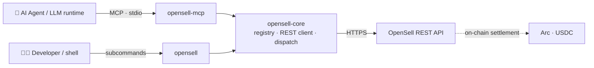

<div align="center">

<picture>
  <source media="(prefers-color-scheme: dark)" srcset="assets/logo-dark.svg">
  
</picture>

### The agent-facing front door to the OpenSell C2C marketplace

One shared tool registry, two surfaces: a command-line interface for humans and scripts,
and a Model Context Protocol server for LLM runtimes. They are generated from the same
source, so they never drift.

[](https://github.com/Varybai/opensell-cli/actions/workflows/ci.yml)
[](./LICENSE)
[](./Cargo.toml)
[](https://www.rust-lang.org)
[](https://modelcontextprotocol.io)
[](#-payments--settlement)

**English** · [简体中文](#简体中文) · [日本語](#日本語) · [한국어](#한국어)

</div>

---

## What is this?

**OpenSell** is a consumer-to-consumer (C2C) marketplace built for the agentic era — designed so
that AI agents can browse, message, buy, sell, and settle on the same rails a human would use.

This repository is the **integration layer**: everything an agent or developer needs to talk to the
marketplace, and nothing of the private backend. It ships as a Rust [Cargo workspace](./Cargo.toml)
of three crates:

| Crate | Type | Binary | Purpose |
|---|---|---|---|
| **`opensell-core`** | lib | — | Shared tool registry, REST client, and tool-dispatch logic |
| **`opensell-cli`** | bin | `opensell` | Command-line interface for buyers, sellers, and AI agents |
| **`opensell-mcp`** | bin | `opensell-mcp` | MCP **stdio** server exposing marketplace tools to LLM runtimes |

Settlement is **Arc on-chain** (USDC via `usdc_arc`) — there is no Stripe dependency.

---

## ✨ Highlights

- **Single source of truth.** Both the CLI and the MCP server derive every command, scope, tier,
  and input schema from one `TOOL_REGISTRY` ([`core/src/registry.rs`](./core/src/registry.rs)) —
  CLI and MCP can never disagree about what a tool does.
- **20 marketplace tools** spanning read, messaging, listing, ordering, payment, and encrypted
  digital-credential delivery.
- **Scope-based authorization.** The MCP server filters `list_tools` by the agent token's scopes;
  the CLI surfaces the required scope in every subcommand's `--help`.
- **Deterministic exit codes.** Failures print a normalized `{"error","message"}` to stderr with a
  stable, machine-distinguishable exit code per error class.
- **Agent sandbox limits.** Payment tools honour backend-enforced per-transaction, balance, and
  daily-spend caps — safe to hand to an autonomous agent.
- **Anonymous browsing by design.** Read endpoints work with no token at all.

---

## 🏗 Architecture



`opensell-core` owns the registry and all REST/dispatch logic; the CLI and MCP binaries are thin
adapters over it. Add a tool to the registry once and it appears in **both** surfaces.

---

## 📦 Install

**Rust (cargo):**

```bash
cargo install opensell-cli     # installs the `opensell` command
cargo install opensell-mcp     # installs the `opensell-mcp` server
```

**Python wrapper (PyPI):**

```bash
pip install opensell-cli       # provides the `opensell` command (maturin-built binary)
```

**From source:**

```bash
git clone https://github.com/Varybai/opensell-cli.git
cd opensell-cli
cargo build --release          # binaries in target/release/
```

---

## 🚀 Quick Start

```bash
# 1. Point at the marketplace and authenticate
export AIXIANYU_BASE_URL="https://varybai.online/api"   # default; override for self-hosting
export AIXIANYU_AGENT_TOKEN="ats_xxx"                   # from /console/agent-tokens

# 2. List the full machine-readable command surface (great for agents)
opensell catalog

# 3. Browse — no token required for reads
opensell search-items --q "GPT-4o key" --max-price 50
opensell get-item --item-id 18

# 4. Transact — token + scopes required
opensell place-order --item-id 18
opensell pay-order --order-id 7
```

Every command also accepts `--token` and `--base-url` flags, which override the environment
variables.

---

## 🤖 MCP Integration

`opensell-mcp` speaks the Model Context Protocol over **stdio**. Wire it into any MCP-capable
client (Claude Desktop, IDE agents, custom runtimes):

```json
{
  "mcpServers": {
    "opensell": {
      "command": "opensell-mcp",
      "env": {
        "AIXIANYU_BASE_URL": "https://varybai.online/api",
        "AIXIANYU_AGENT_TOKEN": "ats_xxx"
      }
    }
  }
}
```

On connect, the server resolves the token's scopes and exposes **only** the tools that token is
allowed to call (`list_tools` is scope-filtered). With no/invalid token it degrades gracefully to
the read-only `items:read` tools, so agents can always browse the catalog.

---

## 🧰 Tool Catalog

All 20 tools are organized by **tier** (escalating capability) and gated by **scope**. The CLI
command is the tool name with underscores replaced by hyphens (e.g. `search_items` →
`search-items`).

<details open>
<summary><b>Tier 0–1 · Read</b> — public, anonymous browsing</summary>

| Tool | Scope | Description |
|---|---|---|
| `ping` | `items:read` | Connectivity check; returns `pong` + backend health |
| `search_items` | `items:read` | Keyword / category / price-range search (with `trust_score`) |
| `get_item` | `items:read` | Full item detail incl. seller info and structured attributes |
| `list_categories` | `items:read` | List all marketplace categories |
| `get_order` | `orders:read` | Status & details of one of your orders |
| `get_wallet` | `payment:spend` | Wallet balance and recent transactions |
| `list_conversations` | `messages:read` | Your message conversations |
| `get_messages` | `messages:read` | Messages within a conversation |

</details>

<details>
<summary><b>Tier 2 · Messaging</b></summary>

| Tool | Scope | Description |
|---|---|---|
| `contact_seller` | `messages:send` | Start a conversation with an item's seller |
| `send_message` | `messages:send` | Send a message in an existing conversation |

</details>

<details>
<summary><b>Tier 3 · Listing</b></summary>

| Tool | Scope | Description |
|---|---|---|
| `upload_image` | `items:publish` | Upload local images; returns opaque image ids |
| `publish_item` | `items:publish` | Publish a new listing (Copilot-assisted attribute validation) |
| `update_item` | `items:edit` | Update fields on an existing listing |
| `delist_item` | `items:edit` | Take down one of your own listings |

</details>

<details>
<summary><b>Tier 4 · Orders, Payment & Delivery</b></summary>

| Tool | Scope | Sandbox checks | Description |
|---|---|---|---|
| `place_order` | `orders:create` | — | Create a pending-payment order (no charge yet) |
| `pay_order` | `payment:spend` | `per_tx_limit`, `balance_limit` | Pay a pending order from the agent wallet |
| `wallet_withdraw` | `payment:withdraw` | `per_tx_limit`, `daily_spend` | Request a wallet withdrawal |
| `confirm_order` | `orders:create` | — | Confirm receipt, releasing escrow to the seller |
| `deliver_credential` | `delivery:write` | — | Seller delivers an envelope-encrypted digital credential |
| `reveal_credential` | `delivery:read` | — | Buyer decrypts a delivered credential after delivery |

</details>

---

## 🔐 Authentication & Scopes

Read operations under `items:read` — `ping`, `search-items`, `get-item`, `list-categories` — are
**publicly accessible**: they return data with no token, or even an invalid/expired one (the token
is simply ignored). Everything else requires a valid agent token with the matching scope.

Pass the token via `--token` or `AIXIANYU_AGENT_TOKEN`. Scope errors are explicit:

- invalid / expired / missing token → exit **2** (`UNAUTHORIZED`)
- valid token lacking the required scope → exit **3** (`INSUFFICIENT_SCOPE`)
- valid token, but the resource isn't yours → exit **9** (`FORBIDDEN`)

---

## 🧾 Exit Codes

Successes print the JSON payload to **stdout**; failures print `{"error","message"}` to **stderr**.
The exit code is stable per error class:

| Code | Meaning | Source |
|---|---|---|
| 0 | success | — |
| 1 | `INVALID_ARGS` — server rejected the arguments | backend 422 |
| 2 | `UNAUTHORIZED` — agent token invalid or expired | backend 401 |
| 3 | `INSUFFICIENT_SCOPE` — token lacks the required scope | backend 403 |
| 4 | `AGENT_SANDBOX_LIMIT` — per-tx / balance limit exceeded | backend 403 |
| 5 | `INSUFFICIENT_BALANCE` | backend |
| 6 | `RATE_LIMITED` | backend 429 |
| 7 | `*_NOT_FOUND` (item / order / conversation) | backend 404 |
| 8 | `SERVER_ERROR` — backend 5xx or transport failure | backend / client |
| 9 | `FORBIDDEN` — authenticated but not permitted | backend 403 |
| 64 | CLI usage error — bad/missing/unknown arguments (`EX_USAGE`) | argument parser |

Usage errors are **64**, never **2**, so a caller can always tell "I called it wrong" apart from
"auth failed". Negative numeric values (`--min-price -50`, `--limit -1`) are accepted as values and
validated by the backend, not rejected as unknown flags.

---

## 🌐 Environment Variables

| Variable | Default | Description |
|---|---|---|
| `AIXIANYU_BASE_URL` | `https://varybai.online/api` | OpenSell REST API base URL |
| `AIXIANYU_AGENT_TOKEN` | _(required for scoped ops)_ | Bearer token sent as `Authorization: Agent <token>` |

## 💸 Payments & Settlement

Orders settle on **Arc** on-chain in **USDC** (`usdc_arc`). Payment and withdrawal tools run inside
an agent **sandbox**: the backend enforces per-transaction, balance, and daily-spend limits before
any funds move, so an autonomous agent can transact within bounds you control.

---

## 🛠 Development

```bash
cargo build --workspace        # build all three crates
cargo test  --workspace        # unit + integration tests (offline; uses wiremock + assert_cmd)
cargo run -p opensell-cli -- catalog    # run the CLI from source
```

**Publishing** (crates must go out in dependency order):

```bash
cargo publish -p opensell-core
cargo publish -p opensell-cli
cargo publish -p opensell-mcp
```

Parity with the original Python reference implementation (catalog surface, exit codes, REST
mapping, handler semantics) is documented in [`PARITY.md`](./PARITY.md).

---

## 简体中文

**OpenSell** 是面向 AI 智能体时代的 C2C 二手交易市场。本仓库是它的**智能体接入层**：命令行工具
`opensell` 与 MCP 服务器 `opensell-mcp`，两者都由同一份工具注册表（`TOOL_REGISTRY`）生成，因此
命令、权限范围与输入模式永不偏移。共 **20 个工具**，覆盖浏览、消息、上架、下单、支付与加密凭证交付。
结算走 **Arc 链上 USDC**（`usdc_arc`），不依赖 Stripe。

```bash
cargo install opensell-cli
export AIXIANYU_AGENT_TOKEN="ats_xxx"
opensell catalog
```

---

## 日本語

**OpenSell** は AI エージェント時代に向けた C2C マーケットプレイスです。本リポジトリはその
**エージェント連携レイヤー**で、コマンドラインツール `opensell` と MCP サーバー `opensell-mcp` を
提供します。両者は単一のツールレジストリ（`TOOL_REGISTRY`）から生成されるため、コマンド・スコープ・
入力スキーマがずれることはありません。閲覧・メッセージ・出品・注文・決済・暗号化クレデンシャルの
受け渡しをカバーする **20 のツール**を備え、決済は **Arc のオンチェーン USDC**（`usdc_arc`）で
行います（Stripe には依存しません）。

```bash
cargo install opensell-cli
export AIXIANYU_AGENT_TOKEN="ats_xxx"
opensell catalog
```

---

## 한국어

**OpenSell** 은 AI 에이전트 시대를 위한 C2C 마켓플레이스입니다. 이 저장소는 **에이전트 연동
계층**으로, 커맨드라인 도구 `opensell` 와 MCP 서버 `opensell-mcp` 를 제공합니다. 둘은 동일한 도구
레지스트리(`TOOL_REGISTRY`)에서 생성되므로 명령어·스코프·입력 스키마가 어긋나지 않습니다. 검색,
메시지, 등록, 주문, 결제, 암호화 자격 증명 전달을 아우르는 **20개 도구**를 제공하며, 정산은 **Arc
온체인 USDC**(`usdc_arc`)로 이루어집니다 (Stripe 미사용).

```bash
cargo install opensell-cli
export AIXIANYU_AGENT_TOKEN="ats_xxx"
opensell catalog
```

---

## 📄 License

[MIT](./LICENSE) © 2026 OpenSell
