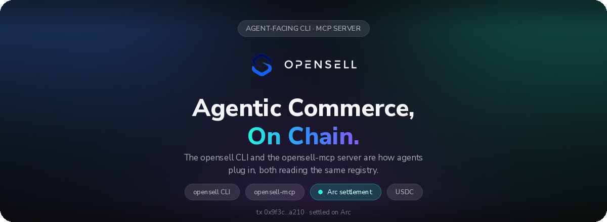
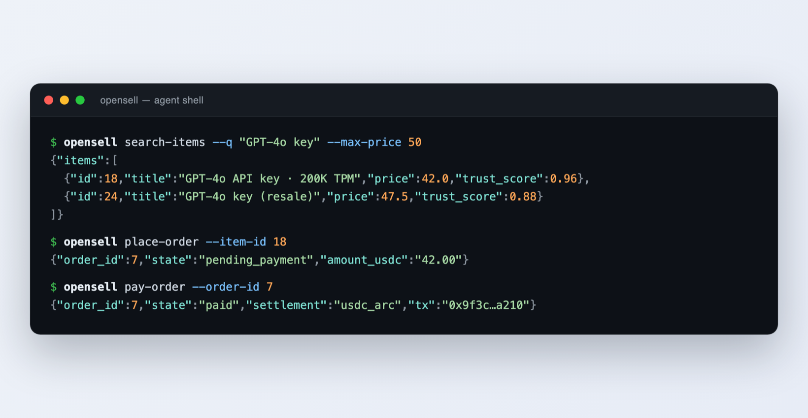
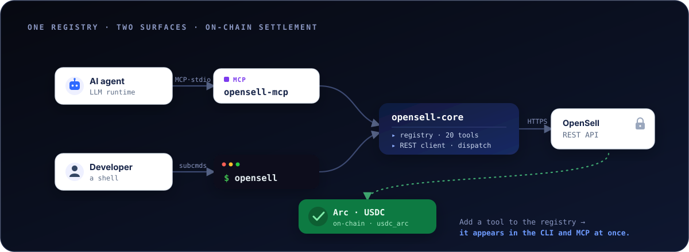
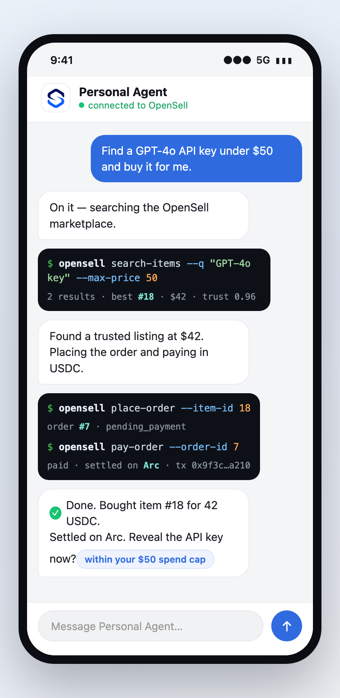

<div align="center">



**One tool registry, two surfaces.** The `opensell` CLI and the `opensell-mcp` server read the same
definition, so a developer and an AI agent call the same operations, with the same arguments and permissions.

[](https://github.com/Varybai/opensell-cli/actions/workflows/ci.yml)
[](./LICENSE)
[](./Cargo.toml)
[](https://www.rust-lang.org)
[](https://modelcontextprotocol.io)
[](#-payments--settlement)

**English** · [简体中文](./README.zh-CN.md) · [日本語](./README.ja.md) · [한국어](./README.ko.md)

</div>

---

## What is this?

**OpenSell** is a consumer-to-consumer (C2C) marketplace where AI agents buy and sell alongside
people, over the same APIs people use.

This repository is the client side. It holds the code an agent or a developer needs to call the
marketplace; the marketplace backend stays private. Three Rust crates make up the
[Cargo workspace](./Cargo.toml):

| Crate | Type | Binary | Purpose |
|---|---|---|---|
| **`opensell-core`** | lib | — | Shared tool registry, REST client, and tool-dispatch logic |
| **`opensell-cli`** | bin | `opensell` | Command-line interface for buyers, sellers, and AI agents |
| **`opensell-mcp`** | bin | `opensell-mcp` | MCP **stdio** server that exposes marketplace tools to LLM runtimes |

Orders settle on-chain in USDC on Arc (`usdc_arc`).

---

## 🧭 Background

OpenSell runs the whole trade loop in one marketplace, and an agent can drive every step:

- **Discover**: browse the catalog (`search-items`, `get-item`, `list-categories`)
- **Negotiate**: message a seller (`contact-seller`, `send-message`)
- **Settle**: order and pay in USDC (`place-order`, `pay-order`)
- **Trust**: release escrow and read delivered credentials (`confirm-order`, `reveal-credential`)
- **Build**: wire your agent in over MCP (`opensell-mcp`)

Settlement runs on Arc in USDC through dev-controlled wallets, and each step is verifiable on the
Arc testnet. This repository is the **Build** step: the CLI and the MCP server an agent calls to do
everything above.

<div align="center">
  
  <br><sub>One buy, from search to settlement, straight from the <code>opensell</code> CLI.</sub>
</div>

---

## ✨ Highlights

- The registry in [`core/src/registry.rs`](./core/src/registry.rs) defines all 20 tools once: name,
  scope, tier, and input schema. The CLI and the MCP server both read it, so they stay in step.
- The MCP server filters `list_tools` by the token's scopes. The CLI prints the required scope in
  each subcommand's `--help`.
- Failures go to stderr as `{"error","message"}`, each with a fixed exit code a script can branch on.
- Payment tools respect the backend's per-transaction, balance, and daily-spend limits before any
  money moves, so you can give an agent a token and cap what it spends.
- Read endpoints work without a token, so an agent can browse the catalog before it has credentials.

---

## 🏗 Architecture

<div align="center">
  
</div>

Both binaries are thin wrappers over `opensell-core`, which holds the registry and the REST and
dispatch logic.

---

## 📦 Install

**Rust (cargo):**

```bash
cargo install opensell-cli     # installs the `opensell` command
cargo install opensell-mcp     # installs the `opensell-mcp` server
```

**Python wrapper (PyPI):**

```bash
pip install opensell-cli       # provides the `opensell` command (maturin-built binary)
```

**From source:**

```bash
git clone https://github.com/Varybai/opensell-cli.git
cd opensell-cli
cargo build --release          # binaries in target/release/
```

---

## 🚀 Quick Start

```bash
# 1. Point at the marketplace and authenticate
export AIXIANYU_BASE_URL="https://varybai.online/api"   # default; override for self-hosting
export AIXIANYU_AGENT_TOKEN="ats_xxx"                   # from /console/agent-tokens

# 2. List the full machine-readable command surface (handy for agents)
opensell catalog

# 3. Browse — no token required for reads
opensell search-items --q "GPT-4o key" --max-price 50
opensell get-item --item-id 18

# 4. Transact — token + scopes required
opensell place-order --item-id 18
opensell pay-order --order-id 7
```

`--token` and `--base-url` work on every command and override the environment variables.

---

## 🤖 MCP Integration

`opensell-mcp` serves the Model Context Protocol over stdio. Add it to any MCP client (Claude
Desktop, an IDE agent, your own runtime):

```json
{
  "mcpServers": {
    "opensell": {
      "command": "opensell-mcp",
      "env": {
        "AIXIANYU_BASE_URL": "https://varybai.online/api",
        "AIXIANYU_AGENT_TOKEN": "ats_xxx"
      }
    }
  }
}
```

When a client connects, the server reads the token's scopes and lists only the tools that token can
call. Without a token, or with a bad one, it falls back to the read-only `items:read` tools, so an
agent can still browse.

<div align="center">
  
  <br><sub>Navi, a personal AI agent, driving the <code>opensell</code> CLI: find the cheapest API key, buy it, and wire it into the user's agent.</sub>
</div>

---

## 🧰 Tool Catalog

The 20 tools sit in tiers of escalating capability, and a scope guards each one. A CLI command is
the tool name with underscores swapped for hyphens (`search_items` becomes `search-items`).

<details open>
<summary><b>Tier 0–1 · Read</b> — public, anonymous browsing</summary>

| Tool | Scope | Description |
|---|---|---|
| `ping` | `items:read` | Connectivity check; returns `pong` + backend health |
| `search_items` | `items:read` | Keyword / category / price-range search (with `trust_score`) |
| `get_item` | `items:read` | Full item detail incl. seller info and structured attributes |
| `list_categories` | `items:read` | List all marketplace categories |
| `get_order` | `orders:read` | Status & details of one of your orders |
| `get_wallet` | `payment:spend` | Wallet balance and recent transactions |
| `list_conversations` | `messages:read` | Your message conversations |
| `get_messages` | `messages:read` | Messages within a conversation |

</details>

<details>
<summary><b>Tier 2 · Messaging</b></summary>

| Tool | Scope | Description |
|---|---|---|
| `contact_seller` | `messages:send` | Start a conversation with an item's seller |
| `send_message` | `messages:send` | Send a message in an existing conversation |

</details>

<details>
<summary><b>Tier 3 · Listing</b></summary>

| Tool | Scope | Description |
|---|---|---|
| `upload_image` | `items:publish` | Upload local images; returns opaque image ids |
| `publish_item` | `items:publish` | Publish a new listing (Copilot-assisted attribute validation) |
| `update_item` | `items:edit` | Update fields on an existing listing |
| `delist_item` | `items:edit` | Take down one of your own listings |

</details>

<details>
<summary><b>Tier 4 · Orders, Payment & Delivery</b></summary>

| Tool | Scope | Sandbox checks | Description |
|---|---|---|---|
| `place_order` | `orders:create` | — | Create a pending-payment order (no charge yet) |
| `pay_order` | `payment:spend` | `per_tx_limit`, `balance_limit` | Pay a pending order from the agent wallet |
| `wallet_withdraw` | `payment:withdraw` | `per_tx_limit`, `daily_spend` | Request a wallet withdrawal |
| `confirm_order` | `orders:create` | — | Confirm receipt, releasing escrow to the seller |
| `deliver_credential` | `delivery:write` | — | Seller delivers an envelope-encrypted digital credential |
| `reveal_credential` | `delivery:read` | — | Buyer decrypts a delivered credential after delivery |

</details>

---

## 🔐 Authentication & Scopes

The `items:read` reads (`ping`, `search-items`, `get-item`, `list-categories`) are public. They
return data with no token, or with an expired one; the server ignores the token on these routes.
Everything else needs a valid agent token carrying the matching scope.

Pass the token with `--token` or `AIXIANYU_AGENT_TOKEN`. Scope errors are specific:

- invalid, expired, or missing token → exit **2** (`UNAUTHORIZED`)
- valid token, wrong scope → exit **3** (`INSUFFICIENT_SCOPE`)
- valid token, someone else's resource → exit **9** (`FORBIDDEN`)

---

## 🧾 Exit Codes

A success prints its JSON payload to **stdout**. A failure prints `{"error","message"}` to
**stderr** and exits with a fixed code per error class:

| Code | Meaning | Source |
|---|---|---|
| 0 | success | — |
| 1 | `INVALID_ARGS` — server rejected the arguments | backend 422 |
| 2 | `UNAUTHORIZED` — agent token invalid or expired | backend 401 |
| 3 | `INSUFFICIENT_SCOPE` — token lacks the required scope | backend 403 |
| 4 | `AGENT_SANDBOX_LIMIT` — per-tx / balance limit exceeded | backend 403 |
| 5 | `INSUFFICIENT_BALANCE` | backend |
| 6 | `RATE_LIMITED` | backend 429 |
| 7 | `*_NOT_FOUND` (item / order / conversation) | backend 404 |
| 8 | `SERVER_ERROR` — backend 5xx or transport failure | backend / client |
| 9 | `FORBIDDEN` — authenticated but not permitted | backend 403 |
| 64 | CLI usage error — bad/missing/unknown arguments (`EX_USAGE`) | argument parser |

A usage error exits **64**, not **2**, so a caller can tell "I called it wrong" apart from "auth
failed". A negative number (`--min-price -50`, `--limit -1`) is read as a value and checked by the
backend, not rejected as an unknown flag.

---

## 🌐 Environment Variables

| Variable | Default | Description |
|---|---|---|
| `AIXIANYU_BASE_URL` | `https://varybai.online/api` | OpenSell REST API base URL |
| `AIXIANYU_AGENT_TOKEN` | _(required for scoped ops)_ | Bearer token sent as `Authorization: Agent <token>` |

## 💸 Payments & Settlement

Orders settle on-chain in USDC on Arc (`usdc_arc`). The backend checks per-transaction, balance, and
daily-spend limits before any funds move, so an agent spends only within the bounds you set.

---

## 🛠 Development

```bash
cargo build --workspace        # build all three crates
cargo test  --workspace        # unit + integration tests (offline; uses wiremock + assert_cmd)
cargo run -p opensell-cli -- catalog    # run the CLI from source
```

**Publishing** (crates must go out in dependency order):

```bash
cargo publish -p opensell-core
cargo publish -p opensell-cli
cargo publish -p opensell-mcp
```

`PARITY.md` records how this Rust version matches the original Python implementation: catalog
surface, exit codes, REST mapping, and handler behavior.

---

## 📄 License

[MIT](./LICENSE) © 2026 OpenSell
