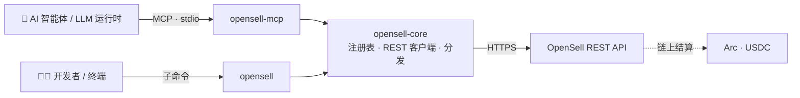

<div align="center">


<picture>
  <source media="(prefers-color-scheme: dark)" srcset="assets/opensell-logo-white.png">
  
</picture>

### 面向 AI 智能体的 OpenSell C2C 交易市场接入层

同一份工具注册表，两种使用形态：一个面向人类与脚本的命令行工具，
以及一个面向 LLM 运行时的 Model Context Protocol（MCP）服务器。
二者由同一来源生成，因此永不偏移。

[](https://github.com/Varybai/opensell-cli/actions/workflows/ci.yml)
[](./LICENSE)
[](./Cargo.toml)
[](https://www.rust-lang.org)
[](https://modelcontextprotocol.io)
[](#-支付与结算)

[English](./README.md) · **简体中文** · [日本語](./README.ja.md) · [한국어](./README.ko.md)

</div>

---

## 这是什么？

**OpenSell** 是一个为智能体时代打造的消费者对消费者（C2C）交易市场——让 AI 智能体能够像人类一样，
在同一套链路上浏览、沟通、买卖与结算。

本仓库是它的**集成层**：包含智能体或开发者与市场对接所需的一切，但**不含**任何私有后端代码。它以一个
Rust [Cargo 工作区](./Cargo.toml)的形式发布，包含三个 crate：

| Crate | 类型 | 二进制 | 用途 |
|---|---|---|---|
| **`opensell-core`** | lib | — | 共享的工具注册表、REST 客户端与工具分发逻辑 |
| **`opensell-cli`** | bin | `opensell` | 面向买家、卖家与 AI 智能体的命令行界面 |
| **`opensell-mcp`** | bin | `opensell-mcp` | 通过 **stdio** 向 LLM 运行时暴露市场工具的 MCP 服务器 |

结算走 **Arc 链上**（USDC，经由 `usdc_arc`）——不依赖 Stripe。

---

## ✨ 亮点

- **单一事实来源。** CLI 与 MCP 服务器的每一个命令、权限范围（scope）、层级（tier）与输入模式
  都派生自同一份 `TOOL_REGISTRY`（[`core/src/registry.rs`](./core/src/registry.rs)）——CLI 与 MCP
  对"某个工具做什么"永远不会产生分歧。
- **20 个市场工具**，覆盖浏览、消息、上架、下单、支付与加密数字凭证交付。
- **基于 scope 的鉴权。** MCP 服务器按智能体 token 的 scope 过滤 `list_tools`；CLI 在每个子命令的
  `--help` 中标明所需 scope。
- **确定性退出码。** 失败时向 stderr 输出规范化的 `{"error","message"}`，每类错误对应稳定、可被
  机器区分的退出码。
- **智能体沙箱限额。** 支付类工具遵守后端强制的单笔、余额与每日消费限额——可安全交给自主智能体使用。
- **匿名浏览即设计。** 读取类接口无需任何 token 即可使用。

---

## 🏗 架构



`opensell-core` 持有注册表与全部 REST／分发逻辑；CLI 与 MCP 二进制只是它之上的薄适配层。
往注册表里加一个工具，它就会**同时**出现在两种形态中。

---

## 📦 安装

**Rust（cargo）：**

```bash
cargo install opensell-cli     # 安装 `opensell` 命令
cargo install opensell-mcp     # 安装 `opensell-mcp` 服务器
```

**Python 包装（PyPI）：**

```bash
pip install opensell-cli       # 提供 `opensell` 命令（maturin 构建的二进制）
```

**从源码构建：**

```bash
git clone https://github.com/Varybai/opensell-cli.git
cd opensell-cli
cargo build --release          # 二进制位于 target/release/
```

---

## 🚀 快速开始

```bash
# 1. 指向市场并完成鉴权
export AIXIANYU_BASE_URL="https://varybai.online/api"   # 默认值；自托管时可覆盖
export AIXIANYU_AGENT_TOKEN="ats_xxx"                   # 来自 /console/agent-tokens

# 2. 列出完整的、机器可读的命令清单（很适合智能体）
opensell catalog

# 3. 浏览——读取无需 token
opensell search-items --q "GPT-4o key" --max-price 50
opensell get-item --item-id 18

# 4. 交易——需要 token 与对应 scope
opensell place-order --item-id 18
opensell pay-order --order-id 7
```

每个命令也都接受 `--token` 与 `--base-url` 参数，它们会覆盖环境变量。

---

## 🤖 MCP 集成

`opensell-mcp` 通过 **stdio** 讲 Model Context Protocol。可接入任何支持 MCP 的客户端
（Claude Desktop、IDE 智能体、自定义运行时）：

```json
{
  "mcpServers": {
    "opensell": {
      "command": "opensell-mcp",
      "env": {
        "AIXIANYU_BASE_URL": "https://varybai.online/api",
        "AIXIANYU_AGENT_TOKEN": "ats_xxx"
      }
    }
  }
}
```

连接时，服务器会解析 token 的 scope，并**只**暴露该 token 被允许调用的工具（`list_tools` 按 scope
过滤）。在无 token／无效 token 时，会优雅降级为只读的 `items:read` 工具，因此智能体始终能浏览目录。

---

## 🧰 工具目录

全部 20 个工具按**层级（tier）**（能力逐级递增）组织，并由 **scope** 把关。CLI 命令即工具名把下划线
替换为连字符（例如 `search_items` → `search-items`）。

<details open>
<summary><b>Tier 0–1 · 读取</b> —— 公开、匿名浏览</summary>

| 工具 | Scope | 说明 |
|---|---|---|
| `ping` | `items:read` | 连通性检查；返回 `pong` + 后端健康状态 |
| `search_items` | `items:read` | 关键词／分类／价格区间搜索（含 `trust_score`） |
| `get_item` | `items:read` | 商品完整详情，含卖家信息与结构化属性 |
| `list_categories` | `items:read` | 列出所有市场分类 |
| `get_order` | `orders:read` | 你的某个订单的状态与详情 |
| `get_wallet` | `payment:spend` | 钱包余额与最近交易 |
| `list_conversations` | `messages:read` | 你的会话列表 |
| `get_messages` | `messages:read` | 某个会话内的消息 |

</details>

<details>
<summary><b>Tier 2 · 消息</b></summary>

| 工具 | Scope | 说明 |
|---|---|---|
| `contact_seller` | `messages:send` | 与某商品的卖家发起会话 |
| `send_message` | `messages:send` | 在已有会话中发送消息 |

</details>

<details>
<summary><b>Tier 3 · 上架</b></summary>

| 工具 | Scope | 说明 |
|---|---|---|
| `upload_image` | `items:publish` | 上传本地图片；返回不透明的图片 id |
| `publish_item` | `items:publish` | 发布新商品（Copilot 辅助校验属性） |
| `update_item` | `items:edit` | 更新已有商品的字段 |
| `delist_item` | `items:edit` | 下架你自己的商品 |

</details>

<details>
<summary><b>Tier 4 · 订单、支付与交付</b></summary>

| 工具 | Scope | 沙箱校验 | 说明 |
|---|---|---|---|
| `place_order` | `orders:create` | — | 创建待支付订单（尚未扣款） |
| `pay_order` | `payment:spend` | `per_tx_limit`、`balance_limit` | 用智能体钱包支付待支付订单 |
| `wallet_withdraw` | `payment:withdraw` | `per_tx_limit`、`daily_spend` | 发起钱包提现 |
| `confirm_order` | `orders:create` | — | 确认收货，向卖家释放托管款 |
| `deliver_credential` | `delivery:write` | — | 卖家交付信封加密的数字凭证 |
| `reveal_credential` | `delivery:read` | — | 买家在交付后解密所得凭证 |

</details>

---

## 🔐 鉴权与权限范围

`items:read` 下的读取操作——`ping`、`search-items`、`get-item`、`list-categories`——是**公开可访问**的：
无 token、甚至无效／过期 token 时也会返回数据（token 被直接忽略）。其余操作都需要带有对应 scope 的
有效智能体 token。

通过 `--token` 或 `AIXIANYU_AGENT_TOKEN` 传入 token。scope 错误是明确的：

- token 无效／过期／缺失 → 退出码 **2**（`UNAUTHORIZED`）
- token 有效但缺少所需 scope → 退出码 **3**（`INSUFFICIENT_SCOPE`）
- token 有效但资源不属于你 → 退出码 **9**（`FORBIDDEN`）

---

## 🧾 退出码

成功时向 **stdout** 输出 JSON 负载；失败时向 **stderr** 输出 `{"error","message"}`。
退出码按错误类别保持稳定：

| 退出码 | 含义 | 来源 |
|---|---|---|
| 0 | 成功 | — |
| 1 | `INVALID_ARGS` —— 服务器拒绝了参数 | 后端 422 |
| 2 | `UNAUTHORIZED` —— 智能体 token 无效或过期 | 后端 401 |
| 3 | `INSUFFICIENT_SCOPE` —— token 缺少所需 scope | 后端 403 |
| 4 | `AGENT_SANDBOX_LIMIT` —— 超出单笔／余额限额 | 后端 403 |
| 5 | `INSUFFICIENT_BALANCE` —— 余额不足 | 后端 |
| 6 | `RATE_LIMITED` —— 触发限流 | 后端 429 |
| 7 | `*_NOT_FOUND`（商品／订单／会话不存在） | 后端 404 |
| 8 | `SERVER_ERROR` —— 后端 5xx 或网络／传输失败 | 后端／客户端 |
| 9 | `FORBIDDEN` —— 已认证但无权限 | 后端 403 |
| 64 | CLI 用法错误 —— 参数错误／缺失／未知（`EX_USAGE`） | 参数解析器 |

用法错误是 **64**，绝不是 **2**，因此调用方总能区分"我调错了"与"鉴权失败"。负数数值
（`--min-price -50`、`--limit -1`）会被当作取值接受并交由后端校验，而非被当成未知参数拒绝。

---

## 🌐 环境变量

| 变量 | 默认值 | 说明 |
|---|---|---|
| `AIXIANYU_BASE_URL` | `https://varybai.online/api` | OpenSell REST API 基础地址 |
| `AIXIANYU_AGENT_TOKEN` | _(scoped 操作必填)_ | 作为 `Authorization: Agent <token>` 发送的令牌 |

## 💸 支付与结算

订单在 **Arc** 链上以 **USDC**（`usdc_arc`）结算。支付与提现类工具运行在智能体**沙箱**内：在任何资金
转移之前，后端会强制执行单笔、余额与每日消费限额，因此自主智能体只能在你设定的边界内交易。

---

## 🛠 开发

```bash
cargo build --workspace        # 构建全部三个 crate
cargo test  --workspace        # 单元 + 集成测试（离线；使用 wiremock + assert_cmd）
cargo run -p opensell-cli -- catalog    # 从源码运行 CLI
```

**发布**（crate 必须按依赖顺序发布）：

```bash
cargo publish -p opensell-core
cargo publish -p opensell-cli
cargo publish -p opensell-mcp
```

与原始 Python 参考实现的一致性（命令清单、退出码、REST 映射、handler 语义）记录在
[`PARITY.md`](./PARITY.md) 中。

---

## 📄 许可证

[MIT](./LICENSE) © 2026 OpenSell
