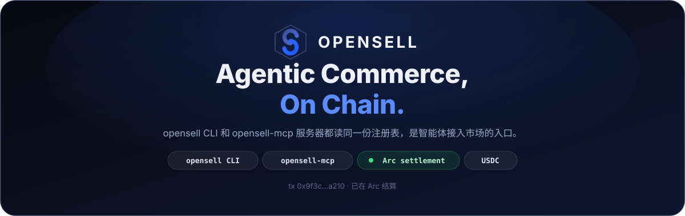
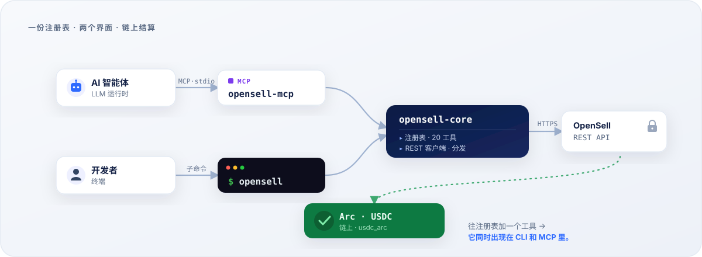

<div align="center">



**一份工具注册表，两个界面。** `opensell` CLI 和 `opensell-mcp` 服务器读取同一份定义，所以开发者和
AI 智能体调用同样的操作，参数和权限也完全一致。

[](https://github.com/Varybai/opensell-cli/actions/workflows/ci.yml)
[](./LICENSE)
[](./Cargo.toml)
[](https://www.rust-lang.org)
[](https://modelcontextprotocol.io)
[](#-支付与结算)

[English](./README.md) · **简体中文** · [日本語](./README.ja.md) · [한국어](./README.ko.md)

</div>

---

## 这是什么？

**OpenSell** 是一个 C2C（个人对个人）二手市场，AI 智能体和真人用同一套 API 买卖。

这个仓库是客户端部分，装着智能体或开发者调用市场所需的代码；市场后端不在这里，保持私有。整个 Rust
[Cargo 工作区](./Cargo.toml)由三个 crate 组成：

| Crate | 类型 | 二进制 | 用途 |
|---|---|---|---|
| **`opensell-core`** | lib | — | 共享的工具注册表、REST 客户端、工具分发逻辑 |
| **`opensell-cli`** | bin | `opensell` | 给买家、卖家和 AI 智能体用的命令行界面 |
| **`opensell-mcp`** | bin | `opensell-mcp` | 通过 **stdio** 把市场工具暴露给 LLM 运行时的 MCP 服务器 |

订单在 Arc 链上以 USDC（`usdc_arc`）结算。

---

## 🧭 背景

OpenSell 把完整的交易闭环放在一个市场里，智能体可以自己跑完每一步：

- **发现**：浏览目录（`search-items`、`get-item`、`list-categories`）
- **协商**：联系卖家（`contact-seller`、`send-message`）
- **结算**：下单并用 USDC 付款（`place-order`、`pay-order`）
- **信任**：释放托管、读取交付的凭证（`confirm-order`、`reveal-credential`）
- **接入**：通过 MCP 把智能体接进来（`opensell-mcp`）

结算在 Arc 链上用 USDC、经由开发者托管钱包完成，每一步都能在 Arc 测试网上核验。这个仓库就是其中的
"接入"一环：智能体调用的命令行工具和 MCP 服务器，上面这些都靠它来做。

<div align="center">
  
  <br><sub>一次完整的购买，从搜索到结算，全在 <code>opensell</code> 命令行里完成。</sub>
</div>

---

## ✨ 亮点

- 注册表 [`core/src/registry.rs`](./core/src/registry.rs) 一次性定义全部 20 个工具：名字、scope、tier、
  输入模式。CLI 和 MCP 服务器都读它，所以两边始终一致。
- MCP 服务器按 token 的 scope 过滤 `list_tools`；CLI 在每个子命令的 `--help` 里写明所需 scope。
- 失败时往 stderr 打 `{"error","message"}`，每类错误带一个固定退出码，脚本可以据此分支。
- 支付类工具在动钱之前先过后端的单笔、余额、每日消费限额，所以你可以把 token 交给智能体，并限定它能花多少。
- 读取接口不需要 token，智能体在拿到凭证之前就能浏览目录。

---

## 🏗 架构

<div align="center">
  
</div>

两个二进制都是 `opensell-core` 之上的薄封装，注册表和 REST／分发逻辑都在 core 里。

---

## 📦 安装

**Rust（cargo）：**

```bash
cargo install opensell-cli     # 安装 `opensell` 命令
cargo install opensell-mcp     # 安装 `opensell-mcp` 服务器
```

**Python 包装（PyPI）：**

```bash
pip install opensell-cli       # 提供 `opensell` 命令（maturin 构建的二进制）
```

**从源码构建：**

```bash
git clone https://github.com/Varybai/opensell-cli.git
cd opensell-cli
cargo build --release          # 二进制位于 target/release/
```

---

## 🚀 快速开始

```bash
# 1. 指向市场并完成鉴权
export AIXIANYU_BASE_URL="https://varybai.online/api"   # 默认值；自托管时可覆盖
export AIXIANYU_AGENT_TOKEN="ats_xxx"                   # 来自 /console/agent-tokens

# 2. 列出完整的、机器可读的命令清单（很适合智能体）
opensell catalog

# 3. 浏览：读取不需要 token
opensell search-items --q "GPT-4o key" --max-price 50
opensell get-item --item-id 18

# 4. 交易：需要 token 和对应 scope
opensell place-order --item-id 18
opensell pay-order --order-id 7
```

`--token` 和 `--base-url` 对每个命令都生效，会覆盖环境变量。

---

## 🤖 MCP 集成

`opensell-mcp` 通过 stdio 提供 Model Context Protocol。把它加到任意 MCP 客户端里（Claude Desktop、
IDE 智能体、你自己的运行时）：

```json
{
  "mcpServers": {
    "opensell": {
      "command": "opensell-mcp",
      "env": {
        "AIXIANYU_BASE_URL": "https://varybai.online/api",
        "AIXIANYU_AGENT_TOKEN": "ats_xxx"
      }
    }
  }
}
```

客户端连上时，服务器读取 token 的 scope，只列出这个 token 能调的工具。没有 token 或 token 无效时，
回退到只读的 `items:read` 工具，智能体仍然能浏览。

<div align="center">
  
  <br><sub>个人 AI 智能体 Navi 驱动 <code>opensell</code> CLI：找到最便宜的 API key、下单购买，并自动配置进用户的智能体。</sub>
</div>

---

## 🧰 工具目录

20 个工具按能力从低到高分层，每个都由一个 scope 把关。CLI 命令就是把工具名里的下划线换成连字符
（`search_items` 写成 `search-items`）。

<details open>
<summary><b>Tier 0–1 · 读取</b>：公开、匿名浏览</summary>

| 工具 | Scope | 说明 |
|---|---|---|
| `ping` | `items:read` | 连通性检查；返回 `pong` 和后端健康状态 |
| `search_items` | `items:read` | 关键词／分类／价格区间搜索（含 `trust_score`） |
| `get_item` | `items:read` | 商品完整详情，含卖家信息与结构化属性 |
| `list_categories` | `items:read` | 列出所有市场分类 |
| `get_order` | `orders:read` | 你的某个订单的状态与详情 |
| `get_wallet` | `payment:spend` | 钱包余额与最近交易 |
| `list_conversations` | `messages:read` | 你的会话列表 |
| `get_messages` | `messages:read` | 某个会话内的消息 |

</details>

<details>
<summary><b>Tier 2 · 消息</b></summary>

| 工具 | Scope | 说明 |
|---|---|---|
| `contact_seller` | `messages:send` | 与某商品的卖家发起会话 |
| `send_message` | `messages:send` | 在已有会话中发送消息 |

</details>

<details>
<summary><b>Tier 3 · 上架</b></summary>

| 工具 | Scope | 说明 |
|---|---|---|
| `upload_image` | `items:publish` | 上传本地图片；返回不透明的图片 id |
| `publish_item` | `items:publish` | 发布新商品（Copilot 辅助校验属性） |
| `update_item` | `items:edit` | 更新已有商品的字段 |
| `delist_item` | `items:edit` | 下架你自己的商品 |

</details>

<details>
<summary><b>Tier 4 · 订单、支付与交付</b></summary>

| 工具 | Scope | 沙箱校验 | 说明 |
|---|---|---|---|
| `place_order` | `orders:create` | — | 创建待支付订单（尚未扣款） |
| `pay_order` | `payment:spend` | `per_tx_limit`、`balance_limit` | 用智能体钱包支付待支付订单 |
| `wallet_withdraw` | `payment:withdraw` | `per_tx_limit`、`daily_spend` | 发起钱包提现 |
| `confirm_order` | `orders:create` | — | 确认收货，向卖家释放托管款 |
| `deliver_credential` | `delivery:write` | — | 卖家交付信封加密的数字凭证 |
| `reveal_credential` | `delivery:read` | — | 买家在交付后解密所得凭证 |

</details>

---

## 🔐 鉴权与权限范围

`items:read` 下的读取（`ping`、`search-items`、`get-item`、`list-categories`）是公开的。无 token、或
token 过期都能拿到数据，这几个接口会忽略 token。其余操作都需要带对应 scope 的有效智能体 token。

用 `--token` 或 `AIXIANYU_AGENT_TOKEN` 传 token。scope 错误很明确：

- token 无效、过期或缺失 → 退出码 **2**（`UNAUTHORIZED`）
- token 有效但 scope 不对 → 退出码 **3**（`INSUFFICIENT_SCOPE`）
- token 有效，但资源是别人的 → 退出码 **9**（`FORBIDDEN`）

---

## 🧾 退出码

成功时把 JSON 负载打到 **stdout**；失败时把 `{"error","message"}` 打到 **stderr**，并按错误类别返回
固定退出码：

| 退出码 | 含义 | 来源 |
|---|---|---|
| 0 | 成功 | — |
| 1 | `INVALID_ARGS`：服务器拒绝了参数 | 后端 422 |
| 2 | `UNAUTHORIZED`：智能体 token 无效或过期 | 后端 401 |
| 3 | `INSUFFICIENT_SCOPE`：token 缺少所需 scope | 后端 403 |
| 4 | `AGENT_SANDBOX_LIMIT`：超出单笔／余额限额 | 后端 403 |
| 5 | `INSUFFICIENT_BALANCE`：余额不足 | 后端 |
| 6 | `RATE_LIMITED`：触发限流 | 后端 429 |
| 7 | `*_NOT_FOUND`（商品／订单／会话不存在） | 后端 404 |
| 8 | `SERVER_ERROR`：后端 5xx 或网络／传输失败 | 后端／客户端 |
| 9 | `FORBIDDEN`：已认证但无权限 | 后端 403 |
| 64 | CLI 用法错误：参数错误／缺失／未知（`EX_USAGE`） | 参数解析器 |

用法错误返回 **64** 而不是 **2**，这样调用方能区分"我调错了"和"鉴权失败"。负数（`--min-price -50`、
`--limit -1`）会被当成取值交给后端校验，不会被当作未知参数拒绝。

---

## 🌐 环境变量

| 变量 | 默认值 | 说明 |
|---|---|---|
| `AIXIANYU_BASE_URL` | `https://varybai.online/api` | OpenSell REST API 基础地址 |
| `AIXIANYU_AGENT_TOKEN` | _(scoped 操作必填)_ | 作为 `Authorization: Agent <token>` 发送的令牌 |

## 💸 支付与结算

订单在 Arc 链上以 USDC（`usdc_arc`）结算。后端在动钱之前先核对单笔、余额、每日消费限额，所以智能体
只能在你设定的额度内花钱。

---

## 🛠 开发

```bash
cargo build --workspace        # 构建全部三个 crate
cargo test  --workspace        # 单元 + 集成测试（离线；用 wiremock + assert_cmd）
cargo run -p opensell-cli -- catalog    # 从源码运行 CLI
```

**发布**（crate 按依赖顺序发）：

```bash
cargo publish -p opensell-core
cargo publish -p opensell-cli
cargo publish -p opensell-mcp
```

[`PARITY.md`](./PARITY.md) 记录了这个 Rust 版本和原始 Python 实现怎么对齐：命令清单、退出码、
REST 映射、handler 行为。

---

## 📄 许可证

[MIT](./LICENSE) © 2026 OpenSell
